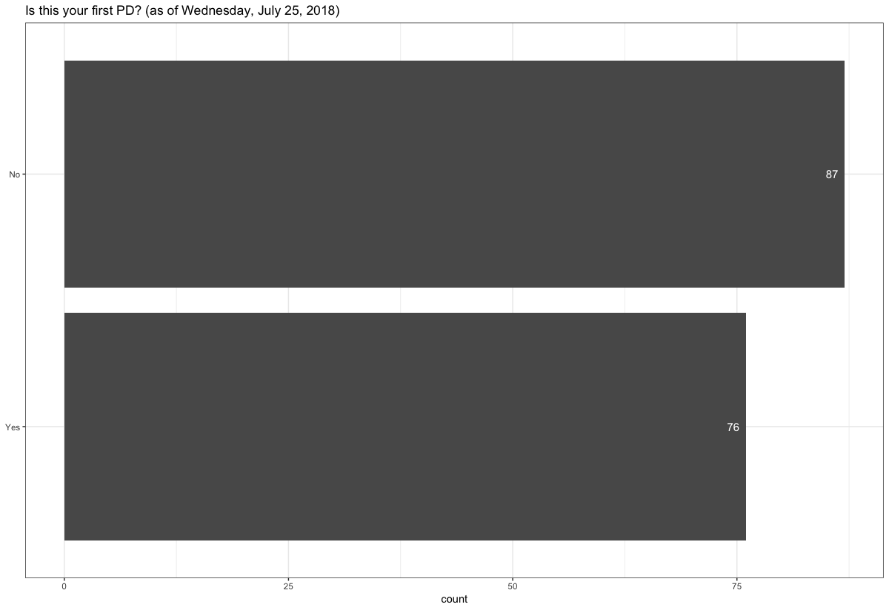
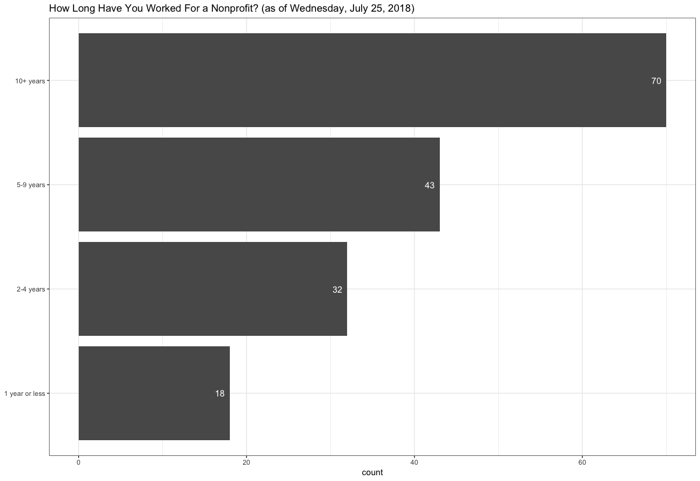
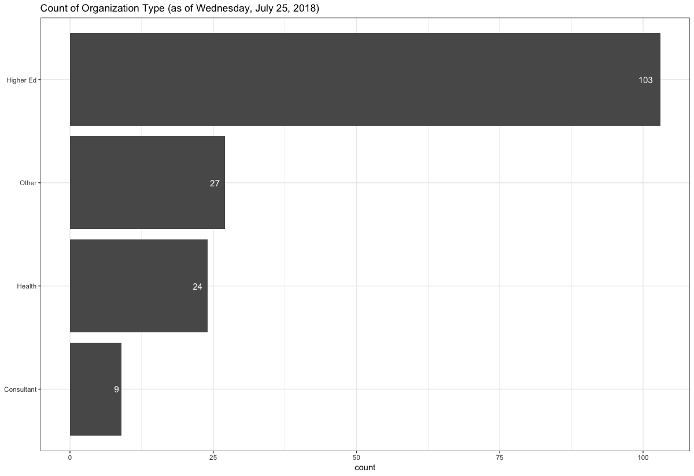
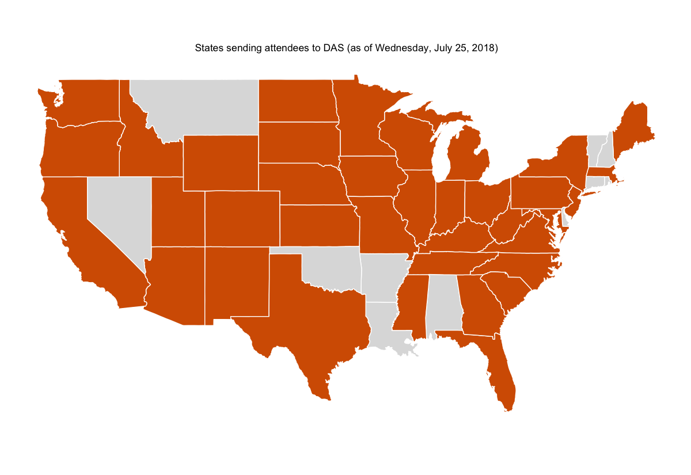
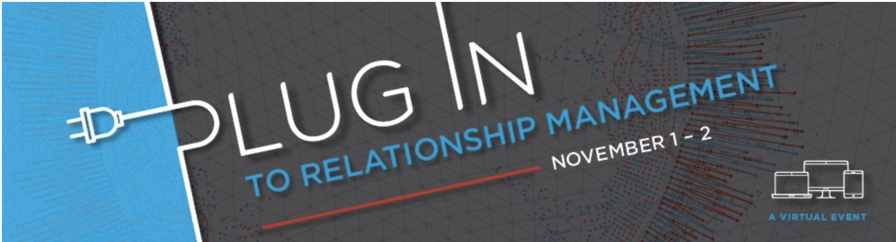
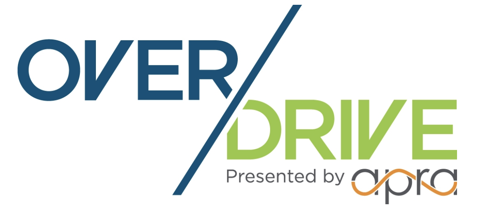
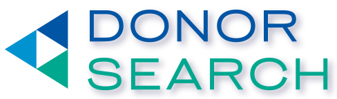
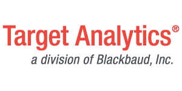
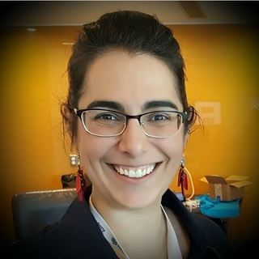

```{r setup, include=FALSE}
options(htmltools.dir.version = FALSE)
```

class: inverse, center, middle

# Who Are You?

???

* We are going to start with the basics
* At last count you are 183 strong
* The largest attendance in the last five years of Data Analytics Symposiums
* I have enjoyed reading your introductions on the Community Forum
* More on that in a minute if you don't know
* I noted a lot of positive energy and enthusiasm in that thread
* And I am really glad you decided to be here today
* This is an analytics conference and you gave me data when you registered so I had to analyze it

---

class: center



???

* For just under half of you this is your first Prospect Development Conference
* My first conference was in New Orleans
* I learned so much (it felt like too much maybe)
* I made some great connections
* I hope the same for you
* I was saying that it can be difficult to explain what we do (it's quite niche)
* Here everyone knows what you do
* We all speak PD. (It's a little like going to band camp)
* The other thing is that while their a good number of you 
* This is still a small group relative to PD and I thin there is strength in that

---

class: center



???

* Many of you have worked in nonprofits for a while but are maybe new to analytics  
* When I started down this road I though I suddenly had super powers  
* However, I also felt really overwhelmed at times  
* My advice is to pick one or two ideas that could have value and share those first  
* Then grow slowly  
* You'll get a lot of ideas today  
* I am hopefully you will find some you can act on now  
* I also hope you find some to work towards later

---

class: center



???

* Many that attend this conference are from Higher Ed and that is still true  
* However, a third of you are from outside Higher Ed (museums, religious organizations, radio)  
* I hope you can find each other because I personally think it can be a bigger challenge
* You may need to swap in other ideas today during sessions
* Instead of looking at data such as Alumni and Parents, you will use different membership classes

---

class: center



???

* I am so excited that you are from everywhere
* I am glad our message got out to everyone
* I am glad there interest from so many places
* I also just think this is fun for us to learn about so many different places as we talk today
---

class: inverse, center, middle

# Let's Talk Format

???

Let's talk about the format for this symposium

---

.pull-left[
**Start-Up Tracks**

* Generally better suited to those just getting started

]

.pull-right[
**Enterprise Tracks**

* Generally better for those from more established shops
]

???

* These are pretty obvious and basic descriptions
* I include these just to get to my next point
* Also in terms of content we used past feedback
* We have several Intro sessions and non-technical sessions
* We have covered most of the major tools and resources
* We definitely have some quite advanced sessions for the more experienced
* Panel will try to address bigger problems later

--

However, you do not need to stay in one track the entire time

--

## Hearing You...

* Beginner guide to Data Analytics

--

* More diversity in the program

--

* More concept-focused advanced analytics sessions

--

* More emphasis on HOW analytics is being used

--

* Overview of the big problems PD/Analytics teams are being asked to solve

???

* These are pretty obvious and basic descriptions
* I include these just to get to my next point
* Also in terms of content we used past feedback
* We have several Intro sessions and non-technical sessions
* We have covered most of the major tools and resources
* We definitely have some quite advanced sessions for the more experienced
* Panel will try to address bigger problems later

---

## A few schedule changes

???

* Unfortunately we do have a few schedule changes
* No Jesse so I will do my best with some similar content
* Brian is an hour now
* No Justin but we have Glenda and Rodger
* Rich had no flight

--

* Jesse Mostipak
    + Could not be here
    + I will fill in with similar content
    + 10:15am (Start-Up Track: Room 317-318)
    
--

* Brian Zive - Top Excel Techniques 
    + Changed from 10:15am -> 2:00pm
    + still Start-Up (Room 317-318) 
    + Now an hour!!
    
--

* Justin Hite 
   + Changed jobs so had to withdraw
   + Rodger Devine and Glenda Carnate will fill in
   + Half-hour sessions each 11am (Enterprise Track: Room 315-316)
   
--

* Rich Majerus
   + Flights from Maine cancelled
   + We could go through his DataCamp course together


???

* Unfortunately we do have a few schedule changes
* No Jesse so I will do my best with some similar content
* Brian is an hour now
* No Justin but we have Glenda and Rodger
* Rich had no flight

---

class: inverse, center, middle

# New Features

---

class: center, middle

> I think some sort of session/activity that resulted in more interaction with others attending the symposium would be helpful, outside of just talks.

> The lunch break on the first day felt like it disrupted the flow just when the conference was starting to get going.

???

These are paraphrased but this is the gist
--- 

---
## As a result...

???

* Lunch Groups more details in a minute
* Four topics, completely optional but an opportunity to keep up the momentum
* Office Hours: time to interact and connect learners with those with more experience
* The Forum: I will add sessions later (earlier sessions you will have to add in later)
* I wanted to add these early but couldn't do it silently and wanted to give you a warning

--

* Lunch Groups

    + Opportunity for participants to gather and discuss a topic rather than having everyone go their separate ways
    
    + Hopefully, encourage conversation and interaction between particpants and not just presenter to participants

--
    
* Office Hours

    + Match those with experience with those seeking to learn 
    
    + Help to facilitate relationships that are like mentor/learner 

--
    
* Community Forum

    + Look for an email for every session (so 20 or so emails)
    
    + Record extra details like if something is discussed spontaneously
    
    + Extra questions and references can be placed in these threads


---

class: center, middle

# Please Take Surveys
## We Are Listening

???

* All this talk of format is to say
* Please take the surveys on your app
* We are listening
    
---

# A few more details:

* Lunch Groups (Here in this room):

* Topics and Tables:

    + A: Starting a Data Analytics Shop
    + B: Going from Basic to More Sophisticated
    + C: Building a Model
    + D: Measuring Performance/Increasing Efficiency
    
Back | Wall
-----|-----
A    | C
B    | D
Stage|Stage

???

* Lunch groups a bit more detail
* Sorry for the crude drawing but hopefully you can get it
* Make a note. I'll put the slide back up at that time
* Each table will have a DAS Committee member available as well 
* So you'll go and get whatever food you want and then bring it back and meet here if you would like
* I am trying something new
* This can be filed under: I can't ask you to do something I wouldn't do myself 
* so these slides are in R and I'm still learning

---

# Office Hours

* Meet Here between 8-9 

* I sent emails if you didn't get an email please let me know

* Still seven (7) spots left

* email me: pawlus@usc.edu

???

* Office Hours: seven spots left
* Email me before the end of the day
* After the panel, I'll get back with you 
    
---

class: inverse, center, middle

# From Particpants to Collaborators

???

* Take the survey but also talk to me and the commitee (listed later)

---

## Areas where we can work together:

* More presentations on using Python (rather than just R)

* Courses in learning R or learning Python

* More workshops rather than just talks


???

* Let's talk about workshops
* We can do a trial with the Rich thing today
* My concern especially with beginner level is technical issues
* Different starting spaces
* I don't want it to be a frustrating experience
* We can do a course and then talk on Slack 
---

## You can help:

* Give me names of people you know using Python

   + Let's try to get them next year
   
* Let's keep in contact (Slack, Twitter or Community Forum)

  + Speaking of Twitter: #ApraDAS2018 

* Let's set-up challenges using familiar data

    + Send me anonymous data or get in me in touch with presenters sharing anonymized data

* Let's form teams and take classes together

???

* I still feel we need more Python but I don't know many people
* If you do, email me and I'll add them to a list for next year
* We can do more than the Forum (how can we stay connected)
* I want to create a central area for anonymous data
* Easier to share and modify scripts, illustrate ideas
* There are classes -- or we could possibly build something and work remotely
* Options: Please take an active role
* Also okay if you just want to be here for the conference
* If you want to be more involved that would be welcome

---

class: inverse, center, middle

# Upcoming Conferences

???

* Other things that may be of interest to you

---



* Janna Holm chairing
* November 1-2
* Registration Open
* Main Benefits: Price and Flexibility
* Amazing Speaker List
* More Netowrking Opportunities
* Good fit for beginners or experts

???

* Janna has the keys so you know it is going to be good
* Quite affordable and incredible content (including USC)

---



* Rich Majerus chairing
* Keynote speaker - Corey Krawiec
    + Manager of player evaluation and analytics for the Baltimore Ravens

???

* Just getting started but already a cool keynote
* You could see crossover between player evaluation and fundraiser evaluation
* Rich at the helm, it is going to be good

---

class: inverse, center, middle

# This programming is made possible due to...

???

* I am just about done but let me thank a few people
* Again this is the largest attendancde in five years

---
# Incredible Sponsors

.pull-left[



* 7pm to 10pm on Thursday August 9th 
* Kimpton Hotel Monaco (620 William Penn Place)
* RSVP: bit.ly/2AFGF2K
] 

.pull-right[

* 6pm to 8pm on Thursday August 9th 
* Allegheny Ballroom inside the Westin Convention Center
* RSVP: http://events.blackbaud.com/prospectdevelopment2018  
* Prospectdevelopment2018
]

???

* A huge thanks to our sponsors
* Each of which is hosting an event
* No better way to thank then then going to their parties and taking all their free stuff
* I have good interactions with both vendors
* Good to know the people behind the scenes and what they are working on

---

class: center, middle

# So many that have made this day possible...

--

* Amy Carrier

--

* Amy Cheng and Renee Reidel

--
* Leigh Petersen, Tommy Tavenner, Emma Hinke

--

* Data Analytics Symposium Committee
   + Carrick Davis, Marianne Pelletier, Lindsay Brown
   + Mirabai Auer, Heidi Harmelink, Emma Hinke, Michael Lasala, Claudia Rangel
   + Julia Bojarcik, Samantha Wren

--

* All our Session Presenters

--

* Participants like you

???

* So many helped us to get to this day
* Amy and her team were amazing and their numbers are stellar
* Our numbers are due to that
* Amy and Renee have done so much work
* Past DAS Chairs and their committees laid the foundation
* The current committee: outreach, recruitment, ideation, volunteering day-of, presenting
* So many great sessions
* All of you for being here
* One last person to thank and introduce

---

class: inverse, center, middle

# Keynote Presenter: Renée Teate

???

* Our keynote

---
class: middle

# Keynote Presenter

.pull-left[
**Renée Teate**



]

.pull-right[
* Before Meeting Renée: @BecomingDataSci

* Becoming a Data Scientist Podcasts

    + My favorites:
        * Will Kurt 
        * Safia Abdalla
        * Debbie Berebichez

* \#SoDS18 (Summer of Data Science)

* DataSciGuide (http://www.datasciguide.com/)
]

    
???

* She will go over her career so I will just touch on her inluence and impact on the community
* Before I met Renee I was following her on Twitter
* I would sometimes have ideas for getting more involved and Renee was doing them
* Her account really connected because it was in real time
* People could see her moving through the process
* She wisely started her podcast and got to know so many data scientists and shared that with us
* My favorites: Will (librarian), Safia (enthusiasm and drive), Debbie (story of Rupesh)
* Get involved with SoDS . So many new learners take part. It's great for them to have this and me.
* DataSciGuide ideas on where to start
* Job page, I'm not sure I should promote but you can find it

