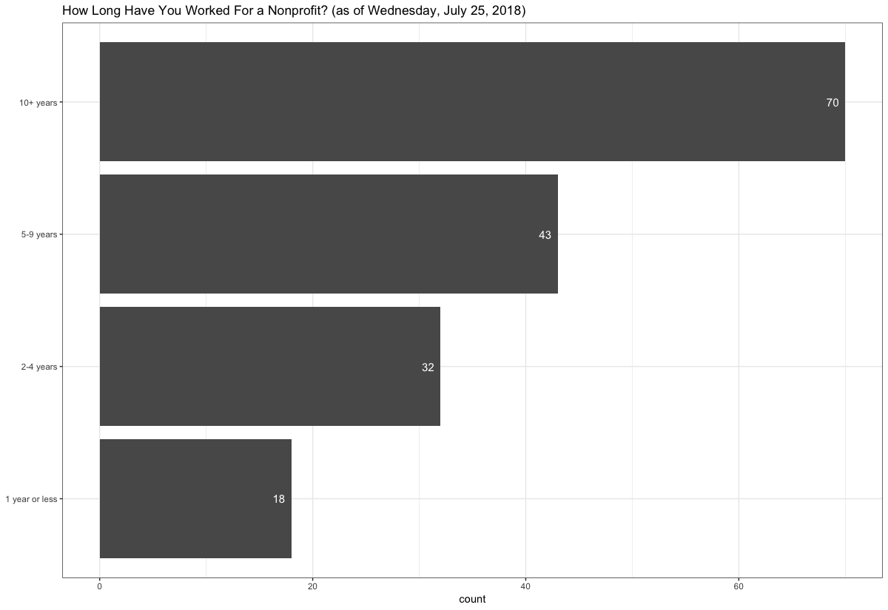
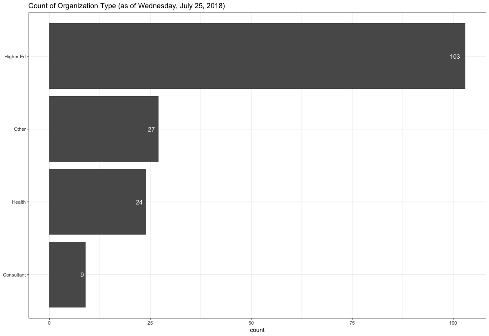
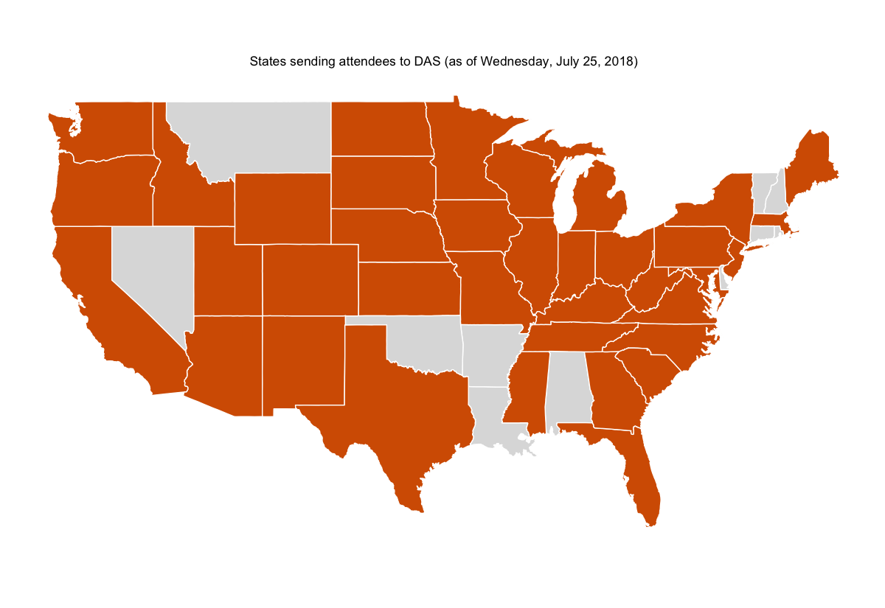
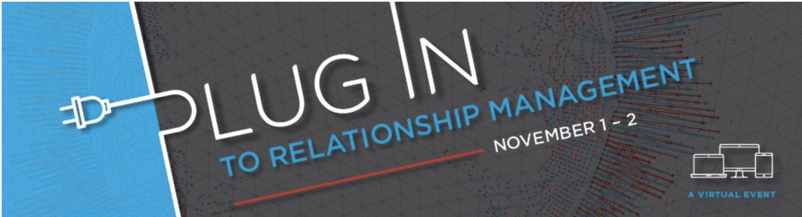
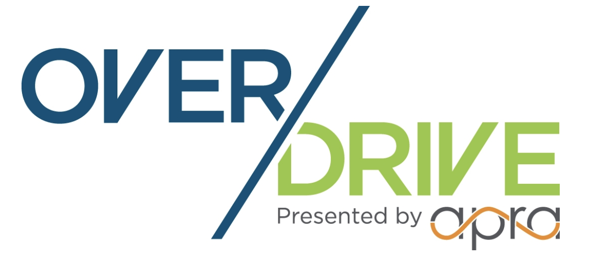
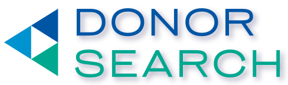
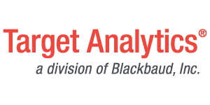
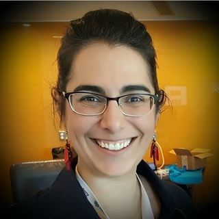

```{r setup, include=FALSE}
options(htmltools.dir.version = FALSE)
```

class: inverse, center, middle

# Who Are You?

???

We are going to start with the basics
At last count you are 183 strong
The largest attendance in the last five years of Data Analytics Symposiums
I have enjoyed reading your introductions on the Community Forum
More on that in a minute if you don't know
I noted a lot of positive energy and enthusiasm in that thread
And I am really glad you decided to be here today
This is an analytics conference and you gave me data when you registered so I had to analyze it

---

class: center


???

For just under half of you this is your first Prospect Development Conference
My first conference was in New Orleans
I learned so much (it felt like too much maybe)
I made some great connections
I hope the same for you
I was saying that it can be difficult to explain what we do (it's quite niche)
Here everyone knows what you do
We all speak PD. (It's a little like going to band camp)
The other thing is that while their a good number of you 
This is still a small group relative to PD and I thin there is strength in that

---

class: center



---

class: center



---

class: center



---

class: inverse, center, middle

# Let's Talk Format

???

Add gif

---

.pull-left[
**Start-Up Tracks**

* Generally better suited to those just getting started

]

.pull-right[
**Enterprise Tracks**

* Generally better for those from more established shops
]

--

However, you do not need to stay in one track the entire time

--

## Hearing You...

* Beginner guide to Data Analytics

--

* More diversity in the program

--

* More concept-focused advanced analytics sessions

--

* More emphasis on HOW analytics is being used

--

* Overview of the big problems PD/Analytics teams are being asked to solve

???

I think we need to change this just to say that you don't need to stay in one track.

---

## A few schedule changes

--

* Jesse Mostipak
    + Could not be here
    + I will fill in with similar content
    + 10:15am (Start-Up Track: Room 317-318)
    
--

* Brian Zive - Top Excel Techniques 
    + Changed from 10:15am -> 2:00pm
    + still Start-Up (Room 317-318) 
    + Now an hour!!
    
--

* Justin Hite 
   + Changed jobs so had to withdraw
   + Rodger Devine and Glenda Carnate will fill in
   + Half-hour sessions each 11am (Enterprise Track: Room 315-316)
   
--

* Rich Majerus
   + Flights from Maine cancelled
   + We could go through his DataCamp course together

---

class: inverse, center, middle

# New Features

---

class: center, middle

> I think some sort of session/activity that resulted in more interaction with others attending the symposium would be helpful, outside of just talks.

> The lunch break on the first day felt like it disrupted the flow just when the conference was starting to get going.

--- 

---
## As a result...

--

* Lunch Groups

    + Opportunity for participants to gather and discuss a topic rather than having everyone go their separate ways
    
    + Hopefully, encourage conversation and interaction between particpants and not just presenter to participants

--
    
* Office Hours

    + Match those with experience with those seeking to learn 
    
    + Help to facilitate relationships that are like mentor/learner 

--
    
* Community Forum

    + Look for an email for every session (so 20 or so emails)
    
    + Record extra details like if something is discussed spontaneously
    
    + Extra questions and references can be placed in these threads

---

class: center, middle

# Please Take Surveys
## We Are Listening
    
---

# A few more details:

* Lunch Groups (Here in this room):

* Topics and Tables:

    + A: Starting a Data Analytics Shop
    + B: Going from Basic to More Sophisticated
    + C: Building a Model
    + D: Measuring Performance/Increasing Efficiency
    
Back | Wall
-----|-----
A    | C
B    | D
Stage|Stage

---

# Office Hours

* Meet Here between 8-9 

* I sent emails if you didn't get an email please let me know

* Still seven (7) spots left

* email me: pawlus@usc.edu
    
---

class: inverse, center, middle

# From Particpants to Collaborators

---

## Areas where we can work together:

* More presentations on using Python (rather than just R)

* Courses in learning R or learning Python

* More workshops rather than just talks

---

## You can help:

* Give me names of people you know using Python

   + Let's try to get them next year
   
* Let's keep in contact (Slack, Twitter or Community Forum)

  + Speaking of Twitter: #ApraDAS2018 

* Let's set-up challenges using familiar data

    + Send me anonymous data or get in me in touch with presenters sharing anonymized data

* Let's form teams and take classes together

???

Maybe split (You Can Help) to its own slide

---

class: inverse, center, middle

# Upcoming Conferences

---



* Janna Holm chairing
* November 1-2
* Registration Open
* Main Benefits: Price and Flexibility
* Amazing Speaker List
* More Netowrking Opportunities
* Good fit for beginners or experts


---



* Rich Majerus chairing
* Keynote speaker - Corey Krawiec
    + Manager of player evaluation and analytics for the Baltimore Ravens

---

class: inverse, center, middle

# This programming is made possible due to...

---
# Incredible Sponsors

.pull-left[



* 7pm to 10pm on Thursday August 9th 
* Kimpton Hotel Monaco (620 William Penn Place)
* RSVP: bit.ly/2AFGF2K
] 

.pull-right[

* 6pm to 8pm on Thursday August 9th 
* Allegheny Ballroom inside the Westin Convention Center
* RSVP: http://events.blackbaud.com/prospectdevelopment2018  
* Prospectdevelopment2018
]

---

class: center, middle

# So many that have made this day possible...

--

* Amy Carrier

--

* Amy Cheng and Renee Reidel

--
* Leigh Petersen, Tommy Tavenner, Emma Hinke

--

* Data Analytics Symposium Committee

--

* All our Session Presenters

--

* Participants like you

---

class: inverse, center, middle

# Keynote Presenter: Renée Teate

---
class: middle

# Keynote Presenter

.pull-left[
**Renée Teate**



]

.pull-right[
* Before Meeting Renée: @BecomingDataSci

* Becoming a Data Scientist Podcasts

    + My favorites:
        * Will Kurt 
        * Safia Abdalla
        * Debbie Berebichez

* \#SoDS18 (Summer of Data Science)

* DataSciGuide (http://www.datasciguide.com/)
]

    
???

Use triple ??? to break for slide notes
Hit "P" in browser for presenter view
"C" for cloned view
Push cloned view to extended display for public and keep presenter view on my display
Remember to thank past people
Can switch between markdown and straight HTML

