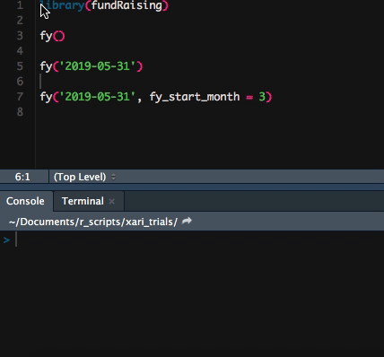

class: middle

# Let's Use This Thing

---

class: center, middle, inverse

But wait, what is it?

---

class: left

## fundRaising: an idea is born

--

* Are there similar processes that we all do?

--

* ..that are specific to fundraising analytics?

--

* Could we have a central location for these functions?

--

* Can we build this library together so we aren't all repeating work?

--

---

class: left

## Agenda

--

* Quick look at some of the functions currently available

--

* Why this matters / Why you should care

--

* How to get involved

---

class: left

## fundRaising: functions currently available

### Fiscal Year Functions

* `fydaynum()` - determine the day of the fiscal year from a date

* `fy()` - determine the fiscal year from a date and select any month as the start of the fiscal year

* `fy_quarters()` - calculate the fiscal quarter for all gifts based on the fiscal year start month

---

class: left

## fundRaising: functions currently available

### Giving Functions

* `longest_consecutive()` - determine the longest consecutive giving streak for constituents

* `consistency()` - the rate of fiscal years with a gift over the number of active years for a constituent

* `cutgiving()` - bin giving in a coherent, easy to use way

* `flag_lapsed()` - create a column with a flag indicating the lapsed donor status

---

class: left

## fundRaising: functions currently available

### Geographic Functions

* `get_lat_lon()` - create a table of longitude and latitude coordinates based on address data

* `get_FIPS()` - use longitude and latitude to gather FIPS codes

* `parse_fips()` - parse FIPS codes into component parts such as state, county, tract, block group and block

* `query_acs()` - query ACS data based on FIPS codes

---

class: left

## Cutgiving walkthrough

---

class: left

## A few more FY functions

---

class: left

## Why this matters

### An example of the issues with proprietary software

---

class: left

## Why this matters

### Meanwhile in the world of open source software

* Everything is transparent

* Seeing the code means you know why something is some way

* With actively maintained work, comments don't go unanswered for years

* You have a more direct way to make a change

---

class: left

## Ways to contribute

### Beta test

* Download the package and try it out

* If everything works or if it doesn't there is a next step

---

class: left

## Ways to contribute

### Submit feature requests, bugs/issues and general questions

---

class: left

## Ways to contribute

### Submit documentation

* Help us show others how to use the functions

* There is test data with the package 

---

class: left

## Ways to contribute

### Modify some code or add some new code

* Remember that if you break something we can always roll it back

---

class: left

## Ways to contribute

### Add ideas to the Kaggle library
https://www.kaggle.com/michaelpawlus/fundraising-data

* Use this package or just post any great ideas

* Test data available (always interested in more)
    

---

class: middle, center

## Thank you

pawlus@usc.edu

### Please listen to Data and the Donor

